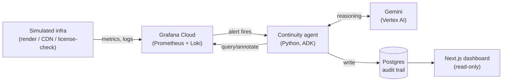

# Continuity

Autonomous incident-response agent for a media production pipeline.
Built for the **Grafana track** of Google's **Agentic Cinema** hackathon
(Google Cloud + Gemini Enterprise Agent Platform).

## Overview

Continuity watches Grafana dashboards and alerts on a simulated media
studio's infrastructure - render pipeline latency, CDN error rates,
license-check failures. When it detects an anomaly, it autonomously:

1. **Investigates** by pulling logs and metrics via the Grafana API.
2. **Correlates** those signals into a root-cause hypothesis using Gemini.
3. **Acts**, taking one bounded, allowlisted remediation action (restart a
   node, roll back a deploy, or file a structured incident report if it
   isn't confident enough to act).
4. **Logs** every decision and its reasoning to Postgres, so the whole
   investigation is auditable after the fact - not just the outcome.

A Next.js dashboard gives a read-only, live view into that reasoning
trail.

## Architecture



Full breakdown, including a step-by-step data flow for one incident, is in
[`docs/architecture.md`](docs/architecture.md).

## Repo layout

```
agent/      Python ADK agent - detection -> investigation -> decision ->
            remediation loop. agent/tools/ holds the individual tool
            functions (query_alerts, fetch_logs, correlate_signals,
            remediate, log_decision).
grafana/    Dashboard JSON exports, alert rule definitions, Prometheus/
            Loki provisioning config.
db/         Postgres schema/migrations for the incident + decision
            audit trail.
frontend/   Next.js dashboard - read-only view into the audit trail.
docs/       Architecture diagram, setup instructions, demo script notes.
```

## Setup

Full instructions: [`docs/setup.md`](docs/setup.md). Short version:

```bash
cp .env.example .env            # fill in real values, never commit this file

createdb continuity && psql continuity -f db/schema.sql

cd agent && pip install -e ".[dev]" && adk web         # agent, with tracing
cd frontend && npm install && npm run dev              # dashboard
```

GCP project ID, region, staging bucket, and service account must match a
real GCP project - see `docs/setup.md` for exactly which env vars those
are. Grafana Cloud stack setup is in [`grafana/README.md`](grafana/README.md).

## Where Gemini / Vertex AI and Grafana are actually called

This repo is judged partly on demonstrating real runtime use of both
services, not just naming them. Concretely:

**Gemini / Vertex AI**
- [`agent/agent.py`](agent/agent.py) - `root_agent = Agent(model=..., tools=ALL_TOOLS, ...)`.
  This wires the agent's entire tool-calling loop to Gemini via Vertex AI;
  every tool-selection decision the agent makes is a live Vertex AI call
  made by the ADK runtime.
- [`agent/tools/correlate_signals.py`](agent/tools/correlate_signals.py) -
  an explicit, second call site: `genai.Client(vertexai=True, project=...,
  location=...).models.generate_content(...)`, used to turn gathered
  alerts/logs/metrics into a structured root-cause hypothesis
  (JSON: hypothesis, confidence, recommended_action, evidence_summary).
- [`agent/deploy.py`](agent/deploy.py) - deploys `root_agent` to Vertex AI
  Agent Engine via `vertexai.agent_engines.create(...)`.

**Grafana**
- [`agent/grafana_client.py`](agent/grafana_client.py) - all Grafana HTTP
  API calls: `GET /api/alertmanager/grafana/api/v2/alerts` (firing
  alerts), `POST /api/ds/query` (Prometheus + Loki queries via Grafana's
  datasource proxy), `POST /api/annotations` (marking remediation actions
  on dashboards).
- [`agent/tools/query_alerts.py`](agent/tools/query_alerts.py) - detection
  step, calls `GrafanaClient.list_alert_instances()`.
- [`agent/tools/fetch_logs.py`](agent/tools/fetch_logs.py) - investigation
  step, calls `GrafanaClient.query_loki()` / `.query_prometheus()`.
- [`agent/tools/remediate.py`](agent/tools/remediate.py) - calls
  `GrafanaClient.create_annotation()` after taking (or refusing) an
  action.

## Status

Initial scaffolding. Tool functions are wired to real Grafana API calls
and a real Gemini/Vertex AI call site; remediation actions beyond
`file_incident_report` are stubs pending a real infra control plane to
call (see TODOs in `agent/tools/remediate.py`). Frontend is a single
placeholder page listing incidents.

## License

[MIT](LICENSE)
